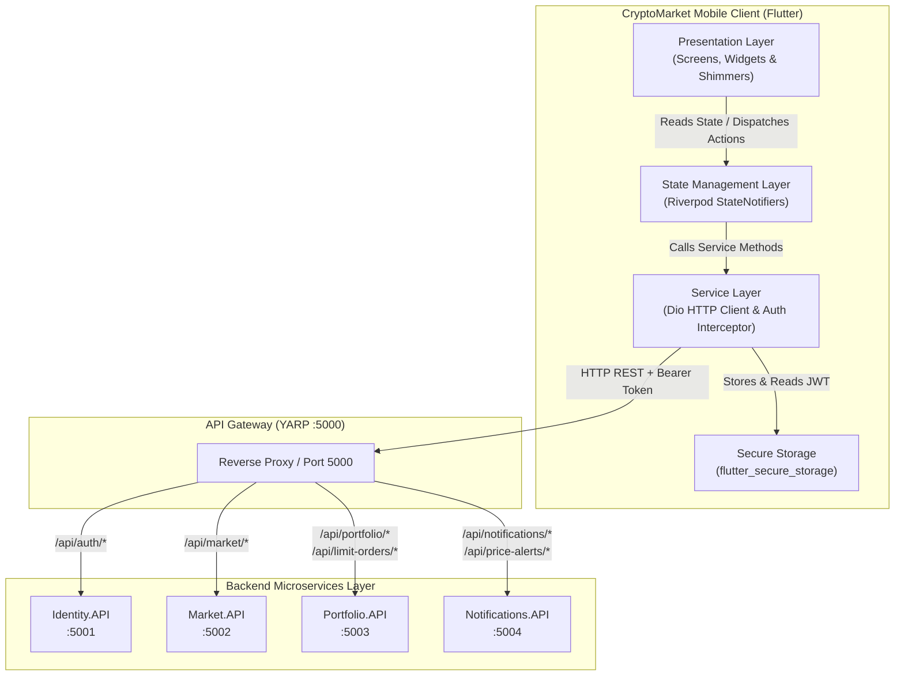
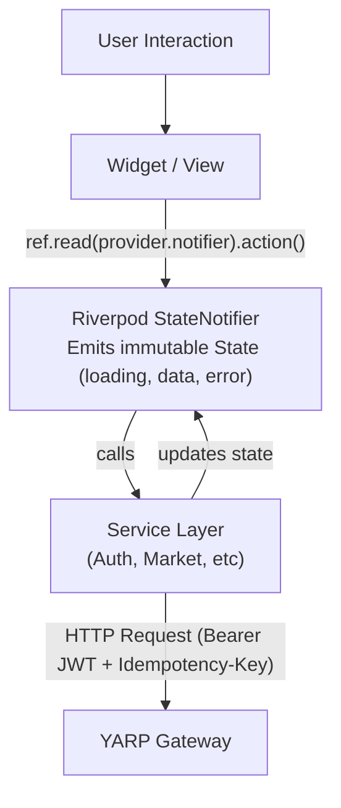

<div align="center">

# CryptoMarket Mobile App

**High-performance, cross-platform cryptocurrency tracking, trading, and portfolio management mobile application built with Flutter & Dart.**

[](https://flutter.dev/)
[](https://dart.dev/)
[](https://riverpod.dev/)
[](https://pub.dev/packages/dio)
[](https://pub.dev/packages/fl_chart)
[](https://www.android.com/)
[](https://developer.apple.com/ios/)

</div>

---

## Table of Contents

- [Overview](#-overview)
- [Key Features](#-key-features)
- [Architecture & Design](#-architecture--design)
- [Technology Stack](#-technology-stack)
- [Project Directory Structure](#-project-directory-structure)
- [Design System & Theme](#-design-system--theme)
- [API Gateway & Backend Integration](#-api-gateway--backend-integration)
- [State Management & Data Flow](#-state-management--data-flow)
- [Screens & User Experience](#-screens--user-experience)
- [Getting Started](#-getting-started)
  - [Prerequisites](#prerequisites)
  - [Installation](#installation)
  - [Emulator & Network Configuration](#emulator--network-configuration)
  - [Running the App](#running-the-app)
- [Testing & Quality Assurance](#-testing--quality-assurance)
- [Security & Offline Resilience](#-security--offline-resilience)

---

## Overview

**CryptoMarket Mobile** is a production-grade, native-feel mobile client for the **CryptoMarket** microservices ecosystem. Built with pure **Flutter and Dart**, it targets both **Android** and **iOS** from a single codebase while providing:

- **Institutional Market Tracking**: Real-time coin prices, percentage changes, 24h stats, and interactive OHLCV financial candlestick charts.
- **Full Trading & Limit Orders**: Instant market execution (buy/sell) and automated limit orders with real-time balance validation.
- **Portfolio & Asset Management**: Fiat balances, portfolio performance, wallet address generation with clipboard integration, and transaction logs.
- **Alerts & Push Center**: Target price alert creation (Above/Below) and real-time in-app notification center with unread badge counters.
- **Curated Crypto News**: Live market news feed with symbol-specific tagging and full article reader.
- **Resilient Mobile UX**: Dark-mode Volt Green aesthetic, shimmer loading skeletons, real-time connectivity banners, error boundaries, and encrypted JWT storage.

---

## Key Features

| Category | Feature | Description |
|---|---|---|
| **Market Intelligence** | Live Coin Directory | Searchable list of all tracked crypto assets with prices, 24h changes, high/low, and volume |
| **Financial Charts** | Interactive Candlesticks | Candlestick OHLCV charts powered by `fl_chart` with timeframe selector (`1H`, `24H`, `7D`, `1M`) |
| **Portfolio & Wallet** | Asset & Balance Tracking | Real-time fiat balance, invested total, individual asset holdings, and deposit/withdraw workflows |
| **Trading Execution** | Buy & Sell Coins | Direct market-order buy and sell execution with immediate balance and holding recalculation |
| **Limit Orders** | Automated Trading | Place conditional limit buy/sell orders; view active orders with inline cancellation |
| **Price Alerts** | Custom Thresholds | Configure alerts for specific price targets (Above/Below) with quick toggle deactivations |
| **Notifications Center** | In-App Alerts | Read notifications, filter by unread, mark individual or all as read, and badge counters |
| **Market News** | Integrated News Feed | Read top cryptocurrency news with category tags, related assets, and rich article view |
| **Security & Auth** | JWT Authentication | Register, login, auto-token refresh, decode user ID, and encrypted token storage |
| **Reliability** | Offline & Error Handling | Real-time offline detection banner, safe error boundary fallback, and shimmer skeletons |

---

## Architecture & Design

The mobile client communicates exclusively with the **YARP API Gateway** (`:5000`), which routes authenticated traffic to the underlying microservices:



### State & Event Flow
1. **User Action**: The user interacts with the UI (e.g. executes a trade, toggles an alert).
2. **Provider Dispatch**: The screen invokes a method on the corresponding Riverpod `StateNotifier`.
3. **HTTP with Interceptors**: `ApiClient` attaches the Bearer JWT token from `flutter_secure_storage` and an `Idempotency-Key` UUID header for transactional safety.
4. **Gateway Forwarding**: YARP forwards the request to the target microservice.
5. **State Update**: The response updates the provider's state, triggering clean, reactive UI re-renders.

---

## Technology Stack

| Layer | Technology | Version | Purpose |
|---|---|---|---|
| **Framework** | [Flutter](https://flutter.dev/) | `>=3.12` | Cross-platform native compilation (Android & iOS) |
| **Language** | [Dart](https://dart.dev/) | `>=3.7` | Strong type safety, pattern matching, sound null-safety |
| **State Management** | [flutter_riverpod](https://pub.dev/packages/flutter_riverpod) | `^2.5.0` | Reactive, testable, dependency-injected state containers |
| **Routing** | [go_router](https://pub.dev/packages/go_router) | `^14.0.0` | Declarative routing, route guards, shell bottom navigation |
| **Networking** | [dio](https://pub.dev/packages/dio) | `^5.4.0` | HTTP client with request/response interceptors & timeouts |
| **Secure Storage** | [flutter_secure_storage](https://pub.dev/packages/flutter_secure_storage) | `^9.2.0` | Keychain (iOS) and EncryptedSharedPreferences (Android) |
| **JWT Decoding** | [jwt_decoder](https://pub.dev/packages/jwt_decoder) | `^2.0.1` | Client-side token validation and claim extraction |
| **Charts** | [fl_chart](https://pub.dev/packages/fl_chart) | `^0.68.0` | High-performance candlestick and line charts |
| **Typography** | [google_fonts](https://pub.dev/packages/google_fonts) | `^6.2.0` | Outfit & Inter typography |
| **Skeleton Loaders** | [shimmer](https://pub.dev/packages/shimmer) | `^3.0.0` | Polished dark-mode loading placeholders |
| **Image Caching** | [cached_network_image](https://pub.dev/packages/cached_network_image) | `^3.3.0` | Memory and disk image caching with SVG support |
| **Connectivity** | [connectivity_plus](https://pub.dev/packages/connectivity_plus) | `^6.0.0` | Real-time offline detection and network state monitoring |
| **Formatting** | [intl](https://pub.dev/packages/intl) | `^0.19.0` | Currency, number, and date/time internationalization |
| **UUID** | [uuid](https://pub.dev/packages/uuid) | `^4.3.0` | Idempotency key generation for financial mutations |

---

## Project Directory Structure

```
mobile/
├── android/                        # Native Android project configuration
├── ios/                            # Native iOS project configuration
├── pubspec.yaml                    # Dependencies, assets & metadata
├── analysis_options.yaml           # Linter rules and code quality checks
│
├── test/                           # Automated test suites
│   ├── models_test.dart            # Unit tests for all data models & DTOs
│   └── services_test.dart          # Service layer & SignalR tests
│
└── lib/
    ├── main.dart                   # Application entry point (ProviderScope & AppTheme)
    │
    ├── core/                       # Core shared infrastructure
    │   ├── constants.dart          # Gateway URLs, endpoints, timeframe configs
    │   ├── router/
    │   │   └── app_router.dart     # GoRouter configuration, route guards & ShellRoute
    │   └── theme/
    │       ├── app_colors.dart     # Volt Green palette, dark surfaces, text colors
    │       └── app_theme.dart      # Dark ThemeData, typography, button styles
    │
    ├── models/                     # Strongly-typed data models & DTOs
    │   ├── auth_models.dart        # Login/Register request & response models
    │   ├── market_models.dart      # Coin, Candlestick, PriceHistory models
    │   ├── portfolio_models.dart   # Balance, Asset, Transaction, Dashboard DTOs
    │   ├── limit_order_models.dart # Limit order creation, update, and query DTOs
    │   ├── notification_models.dart# Notification items & status models
    │   ├── price_alert_models.dart # Price alert thresholds & trigger models
    │   └── market_news_models.dart # Market news article & metadata models
    │
    ├── services/                   # Modular API client and network layer
    │   ├── api_client.dart         # Central Dio client with auth interceptors
    │   ├── auth_api.dart           # Authentication & token storage operations
    │   ├── market_api.dart         # Coin catalog and price history queries
    │   ├── portfolio_api.dart      # Balances, deposits, withdrawals, trading
    │   ├── limit_order_api.dart    # Limit order CRUD operations
    │   ├── notification_api.dart   # Notification queries & mark-read methods
    │   ├── price_alert_api.dart    # Price alert creation & deactivations
    │   ├── market_news_api.dart    # News feed queries & symbol filters
    │   └── signalr_service.dart    # WebSocket hub connection profiles & dispatch
    │
    ├── providers/                  # Riverpod StateNotifier state managers
    │   ├── auth_provider.dart      # Auth state, login/logout, user session
    │   ├── market_provider.dart    # Coin listings, search filter, price history
    │   ├── portfolio_provider.dart # Dashboard balances, assets, and buy/sell actions
    │   ├── limit_order_provider.dart# Limit order list, active filter, order creation
    │   ├── notification_provider.dart# Notifications list & unread count badge
    │   ├── price_alert_provider.dart # Price alerts & active toggles
    │   └── market_news_provider.dart # Market news state & symbol queries
    │
    └── views/                      # UI Screens and presentation components
        ├── splash_screen.dart      # Brand splash & auto-login validation
        ├── login_view.dart         # Login screen with validation & show/hide password
        ├── register_screen.dart    # Registration screen with password confirmation
        ├── home_view.dart          # Shell bottom navigation (Market, Portfolio, News, More)
        ├── market_screen.dart      # Live market list, search, asset stats, pull-to-refresh
        ├── coin_detail_screen.dart # Interactive coin view (Charts, Orders, Alerts, News)
        ├── portfolio_screen.dart   # Fiat balances, deposit/withdraw sheet, transactions
        ├── market_news_screen.dart # News feed with pull-to-refresh & search
        ├── news_detail_screen.dart # Full news article view with related assets
        ├── notifications_screen.dart # Notification center with filter tabs
        ├── price_alerts_screen.dart# Active and triggered price alerts screen
        ├── settings_screen.dart    # User profile, notification badges, sign-out
        │
        └── widgets/                # Reusable modular UI widgets
            ├── candlestick_chart.dart # FlChart OHLCV candlestick & timeframe widget
            ├── shimmer_loading.dart   # Reusable dark-mode shimmer skeletons
            ├── connectivity_banner.dart # Offline network detection alert bar
            └── error_boundary.dart    # Graceful error catching with retry action
```

---

## Design System & Theme

The UI is built with a custom dark-mode theme inspired by institutional financial terminals:

- **Background Palette**: Deep charcoal and black surfaces (`#0A0A0A`, `#121212`, `#1A1A1A`) for contrast and battery efficiency on OLED displays.
- **Brand Accent**: High-visibility **Volt Green** (`#DFFF00`) with dim overlay states (`#DFFF001A`) representing growth and precision.
- **Semantic Colors**:
  - Positive / Up: Emerald Green (`#00E676`)
  - Negative / Down: Bright Rose Red (`#FF3B30`)
  - Warning: Warm Amber (`#FF9500`)
- **Typography**: Google Fonts **Outfit** for modern numerical metrics and headings, paired with **Inter** for clean, readable body copy.

---

## API Gateway & Backend Integration

All client network requests pass through the **API Gateway** (`http://localhost:5000` or `http://10.0.2.2:5000` on Android):

```
API Gateway Base URL: http://<HOST>:5000
```

### Endpoints Mapped in Mobile

| Feature Area | Method | Endpoint | Service Route |
|---|---|---|---|
| **Auth** | `POST` | `/api/auth/login` | `Identity.API` |
| **Auth** | `POST` | `/api/auth/register` | `Identity.API` |
| **Market** | `GET` | `/api/market/coins` | `Market.API` |
| **Market** | `GET` | `/api/market/coins/{symbol}/history` | `Market.API` |
| **Market** | `POST` | `/api/market/coins/{symbol}/buy` | `Market.API` |
| **Portfolio** | `GET` | `/api/portfolio/dashboard` | `Portfolio.API` |
| **Portfolio** | `POST` | `/api/portfolio/deposit` | `Portfolio.API` *(Idempotent)* |
| **Portfolio** | `POST` | `/api/portfolio/withdraw` | `Portfolio.API` *(Idempotent)* |
| **Portfolio** | `POST` | `/api/portfolio/buy` | `Portfolio.API` |
| **Portfolio** | `POST` | `/api/portfolio/sell` | `Portfolio.API` |
| **Limit Orders** | `GET` | `/api/limit-orders` | `Portfolio.API` |
| **Limit Orders** | `POST` | `/api/limit-orders` | `Portfolio.API` *(Idempotent)* |
| **Limit Orders** | `PUT` | `/api/limit-orders/{id}` | `Portfolio.API` |
| **Limit Orders** | `DELETE` | `/api/limit-orders/{id}` | `Portfolio.API` |
| **Notifications** | `GET` | `/api/notifications` | `Notifications.API` |
| **Notifications** | `GET` | `/api/notifications/unread-count` | `Notifications.API` |
| **Notifications** | `PUT` | `/api/notifications/{id}/read` | `Notifications.API` |
| **Notifications** | `PUT` | `/api/notifications/read-all` | `Notifications.API` |
| **Price Alerts** | `GET` | `/api/price-alerts` | `Notifications.API` |
| **Price Alerts** | `POST` | `/api/price-alerts` | `Notifications.API` |
| **Price Alerts** | `DELETE` | `/api/price-alerts/{id}` | `Notifications.API` |
| **Market News** | `GET` | `/api/news` | `Market.API` |
| **Market News** | `GET` | `/api/news/{symbol}` | `Market.API` |

### Idempotency Support
Financial transactions (deposits, withdrawals, and limit orders) automatically inject a unique `Idempotency-Key` header generated with `uuid.v4()`:
```dart
headers: {
  'Idempotency-Key': const Uuid().v4(),
}
```
This ensures network timeouts or accidental double taps never result in duplicated financial actions.

---

## State Management & Data Flow

State is managed using **Riverpod 2.5 StateNotifiers**:



- **Clean Decoupling**: View widgets contain zero API or HTTP logic; they strictly consume providers via `ref.watch()`.
- **Granular Loading States**: Every state notifier exposes granular loading indicators, allowing skeleton shimmers during fetches without blocking the entire screen.

---

## Screens & User Experience

### 1. Splash & Authentication (`/splash`, `/login`, `/register`)
- **Splash Screen**: Checks encrypted token validity in background. If valid, instantly redirects to home; otherwise, presents the login flow.
- **Login & Register**: Modern dark cards with field validation, password visibility toggles, and immediate session persistence.

### 2. Market Screen (`/market`)
- Real-time list of all coins with current price, 24h percentage changes, market cap, and volume.
- Fast live search filtering by coin name or symbol.
- Market stat overview cards (Total Market Cap, 24h Volume, Top Gainer).
- Pull-to-refresh and dark shimmer skeleton loaders.

### 3. Coin Detail & Candlestick Chart (`/market/:symbol`)
- **Interactive Financial Chart**: Full OHLCV candlestick chart powered by `fl_chart` with interactive high/low tooltips and timeframe switching (`1H`, `24H`, `7D`, `1M`).
- **Instant Trading Card**: Buy and sell at current market prices with real-time balance checks.
- **Limit Orders Tab**: Place automated limit buy/sell orders and manage open orders with cancellation.
- **Price Alerts Tab**: Create custom threshold notifications (e.g., alert when BTC > $75,000).
- **Related News**: Symbol-filtered news stories for context.

### 4. Portfolio Screen (`/portfolio`)
- Total invested value and fiat balance overview cards.
- Wallet address with one-tap clipboard copy.
- Interactive modal bottom sheet for deposit and withdraw operations.
- User asset holdings breakdown with instant trade navigation.
- Chronological transaction audit trail.

### 5. News & Article Reader (`/news`, `/news/detail`)
- Comprehensive crypto news stream with source badges and timestamps.
- Full-screen article view with typography tailored for reading comfort.
- Related crypto asset tags that deep-link directly into the coin detail screen.

### 6. Notifications & Price Alerts (`/notifications`, `/price-alerts`)
- In-app notification center with `All` and `Unread` filter tabs.
- Mark all as read with one tap.
- Price alert management with active/triggered status filters and deactivation.
- Dynamic badge counter on the bottom navigation bar showing real-time unread notifications.

---

## Getting Started

### Prerequisites

| Tool | Version | Notes |
|---|---|---|
| **Flutter SDK** | `>=3.12.2` | Channel stable |
| **Dart SDK** | `>=3.7.0` | Included with Flutter SDK |
| **Backend Gateway** | Port `5000` | Microservices running via `docker-compose` |
| **Android Studio** | Latest | With Android SDK & Emulator setup |
| **Xcode** | Latest | For macOS / iOS simulator testing |

---

### Installation

1. **Clone the Repository**:
   ```bash
   git clone https://github.com/ibrahimkabadayi/crypto-market-dashboard.git
   cd crypto-market-dashboard/mobile
   ```

2. **Install Flutter Dependencies**:
   ```bash
   flutter pub get
   ```

3. **Verify Flutter Environment**:
   ```bash
   flutter doctor
   ```

---

### Emulator & Network Configuration

The app connects to the API Gateway using the host specified in [lib/core/constants.dart](file:///c:/CryptoMarketProject/mobile/lib/core/constants.dart):

```dart
// lib/core/constants.dart
static const String apiBaseUrl = 'http://localhost:5000';
```

- **Android Emulator**: The Android emulator maps the host machine's `localhost` to `10.0.2.2`. To run on an Android emulator, change `apiBaseUrl` to:
  ```dart
  static const String apiBaseUrl = 'http://10.0.2.2:5000';
  ```
  *(Or use `adb reverse tcp:5000 tcp:5000` to keep `localhost:5000`)*.
- **iOS Simulator**: `http://localhost:5000` works directly.
- **Physical Device**: Use your workstation's local LAN IP (e.g. `http://192.168.1.150:5000`).

---

### Running the App

1. **Ensure Backend Microservices are Running**:
   ```bash
   cd ../backend
   docker-compose up -d
   ```

2. **Start the Flutter App**:
   ```bash
   # Run on connected device or default emulator
   flutter run

   # Or specify target device
   flutter run -d chrome      # Web debugging
   flutter run -d emulator-5554 # Android emulator
   flutter run -d "iPhone 15" # iOS simulator
   ```

---

## Testing & Quality Assurance

The mobile project includes a full unit test suite covering models, serializers, service dependency injection, and SignalR event dispatchers.

### Run Static Analysis
Verify that all code conforms to the Dart and Flutter style guidelines:
```bash
flutter analyze
```
> **Result**: `No issues found!` (0 errors, 0 warnings, 0 lints)

### Run Unit Tests
Execute the automated test suite:
```bash
flutter test
```
> **Result**: `All 14 tests passed!`
> - `models_test.dart` (10 tests):
>   - Auth models serialization (`LoginRequest`, `LoginResponse`, `RegisterRequest`)
>   - Market models parsing & icon URL resolution
>   - Candlestick & price history parsing
>   - Portfolio dashboard & transaction mappings
>   - Limit order models & buy/sell flags
>   - Notification & price alert models with immutable `copyWith`
>   - Market news models deserialization
> - `services_test.dart` (4 tests):
>   - `ApiClient` base URL & default JSON headers
>   - `Idempotency-Key` UUID header generation
>   - Service dependency injection with `ApiClient`
>   - `SignalRService` hub connection profiles & event dispatcher

---

## Security & Offline Resilience

- **Encrypted Token Storage**: JWT bearer tokens are never stored in plain text. They are saved using `flutter_secure_storage`, leveraging **iOS Keychain** and **Android EncryptedSharedPreferences**.
- **Automatic Token Injection**: The `ApiClient` Dio interceptor retrieves the secure token and injects it into every outgoing request. If an endpoint returns `401 Unauthorized`, the session is cleared and the user is safely routed back to login.
- **Connectivity Awareness**: An integrated `ConnectivityBanner` monitors the device's internet connection in real-time, displaying a non-intrusive alert when the device goes offline.
- **Error Boundaries**: Unhandled exceptions are caught by `ErrorBoundary` widgets with friendly recovery actions instead of application crashes.
- **Memory Optimization**: Images use `cached_network_image` with memory and disk cache limits to prevent memory leaks during rapid list scrolling.

---

<div align="center">
  <sub>Developed as part of the CryptoMarket Microservices Ecosystem</sub>
</div>
